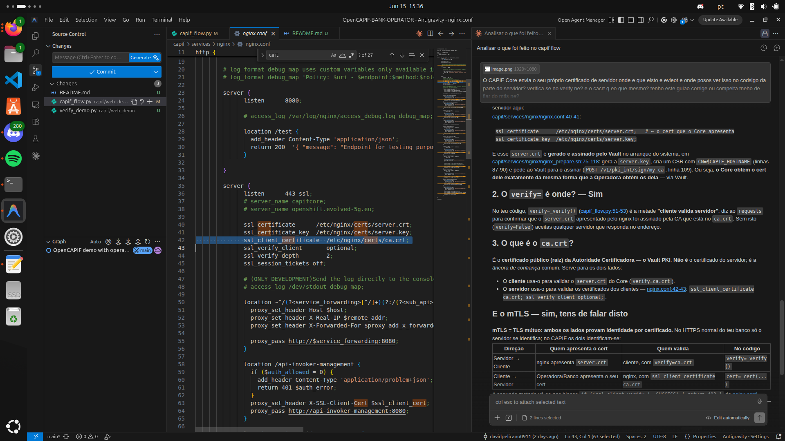

# OpenCAPIF Demo — Operator, Bank & CAPIF

A hands-on demo of **CAPIF** (Common API Framework, 3GPP TS 29.222): the standard
that lets a 5G **Operator** securely expose network APIs to external companies, and
lets a **Bank** discover and consume them.

> **The story in one line:** a Bank is about to approve a transfer. It asks the
> Operator's *SIM Swap* API *"was this number's SIM swapped recently?"* — if yes, it
> **blocks** (likely fraud); if no, it **approves**. CAPIF is the gatekeeper that
> makes this secure and controlled.

---

## The 3 actors

| Who | Role | What it does |
|---|---|---|
| **Operator** | Provider | Publishes the SIM Swap API |
| **Bank** | Invoker | Discovers the API and calls it to prevent fraud |
| **CAPIF** | Gatekeeper | Controls who can publish and who can access |

## Security in one breath
`JWT (login)` → `mTLS (identity)` → `OAuth2 (access)` → `API call`

- **JWT** = temporary badge proving *"I logged in"* (used at registration).
- **mTLS** = certificate instead of password, proving *"I am this entity"* (used to publish/discover). *mTLS proves **WHO YOU ARE**.*
- **OAuth2 token** = access ticket with a `scope` like `SIM_Swap` (shown on each API call). *OAuth2 proves **WHAT YOU CAN DO**.*

> The final API call goes **directly** from Bank to Operator — CAPIF only issues the
> token, it does **not** proxy traffic. That's why the Operator server is simulated by
> `sim_swap_mock.py`.

---

## How to run it

All commands run from the `capif/` folder:

```bash
cd capif
```

### Step 0 — Bring the CAPIF system up (prerequisite)

# fazer primeiro reset_demo.sh para limpar dados do passo anterior (apenas para demonstração)
```bash
./reset_demo.sh
```

```bash
./check_demo.sh        # starts/repairs CAPIF; wait for "✓ Sistema PRONTO"
```

### Step 1 — Start the two servers (two terminals)

```bash
# Terminal 1 — the Operator's API server (leave it running)
python3 sim_swap_mock.py        # listens on http://0.0.0.0:9200

# Terminal 2 — the web portals
python3 web_demo/app.py         # serves http://localhost:8090
```

> Run `./reset_demo.sh` before each demo run to clear data from previous runs
> (so Discovery shows **1** API, not N).

---

## Where to look — the 3 sites

Open these side by side in your browser:

| Screen | URL | Notes |
|---|---|---|
| **Landing page** (3 links) | http://localhost:8090 | start here |
| **Operator portal** | http://localhost:8090/operadora | Provider side |
| **Bank portal** | http://localhost:8090/banco | Invoker side |
| **CAPIF data (MongoDB)** | http://localhost:8082 | login `admin` / `admin` — watch the data appear |

---

## How to test — the full walkthrough

Do these in order and watch the CAPIF (MongoDB) screen react.

### Operator portal (`/operadora`)
1. **Register** → the Operator registers and receives **3 certificates** (APF/AEF/AMF). From now on it authenticates by certificate, not password (**mTLS**).
2. **Publish** → publishes the SIM Swap API into the catalog using its certificate.
   → In **MongoDB (8082)** the API appears under `serviceapidescriptions`.

### Bank portal (`/banco`)
3. **Register** → the Bank registers as an Invoker and gets its certificate.
4. **Discover** → asks CAPIF *"what APIs exist?"* and finds the SIM Swap API **without ever talking to the Operator** (like an App Store).
5. **Get token** → requests an **OAuth2 token** with scope `SIM_Swap`. The fraud check **unlocks** (without a token there is no access — this is CAPIF's access control).
6. **Check a customer** → type a phone number and call the API with the token:
   - `+351912345678` → **APPROVE** (SIM intact, safe transaction)
   - `+351911111111` → **BLOCK** (SIM swapped yesterday → possible fraud)

### Plan B — terminal only (always works)
```bash
# Terminal 1
python3 sim_swap_mock.py
# Terminal 2
./reset_demo.sh && python3 demo_capif.py
```

---

## What to say (closing line)

> *"I demonstrated the full lifecycle of a 5G network API — publish, discover,
> authorize, access — with three security layers (JWT, mTLS, OAuth2). And the Bank
> never spoke directly to the Operator: everything went through CAPIF, the gatekeeper."*

---

## Troubleshooting

- **`400 SSL certificate` when publishing** (CA desynced, e.g. laptop slept):
  ```bash
  cd capif/services && source ./variables.sh && ./clean_capif_docker_services.sh -a && ./run.sh && sleep 30 && docker restart register && sleep 15
  ```
- **`Connection refused`** → the system is down: run `./check_demo.sh`.
- **Golden rule:** disable laptop auto-suspend before presenting.

---

## Ports cheat sheet

| Port | Service |
|---|---|
| `8090` | Web portals (Operator + Bank) |
| `9200` | Operator SIM Swap API server (`sim_swap_mock.py`) |
| `8082` | CAPIF MongoDB viewer (`admin`/`admin`) |
| `443`  | CAPIF Core (nginx) |
| `27017`| MongoDB (CAPIF Core data) |

---

## More docs

Detailed guides live in `capif/`:

| File | What it is |
|---|---|
| `capif/Finaldemo.md` | Full guide (story, security, flow, run) — in Portuguese |
| `capif/docs/GUIA_DEMO.md` | Detailed technical step-by-step |
| `capif/docs/GUIAO_DEMO_AO_VIVO.md` | Live narration script |
| `capif/docs/NOTAS_PASSOS.md` | Notes + Mermaid diagrams per step |
| `capif/docs/PLANO_SLIDES.md` | Slide-by-slide structure |
| `capif/FAQ.md` | Frequently asked questions |




operadaora/banco apresnetam o seu cert (APF_operadora_5g (par)) dps o ngnix valida com ssl_client_certificate /etc/nginx/certs/ca.crt 

ngnix apresenta server.crt 
o cliente valida com verify = ca.crt (verify())

cliente usa o ca.crt para validar o server.crt do core (verify=ca.crt)
servid