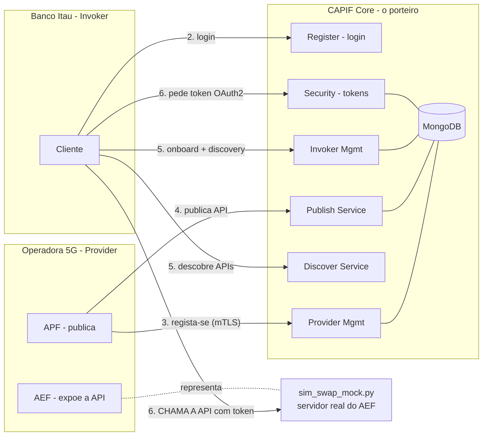
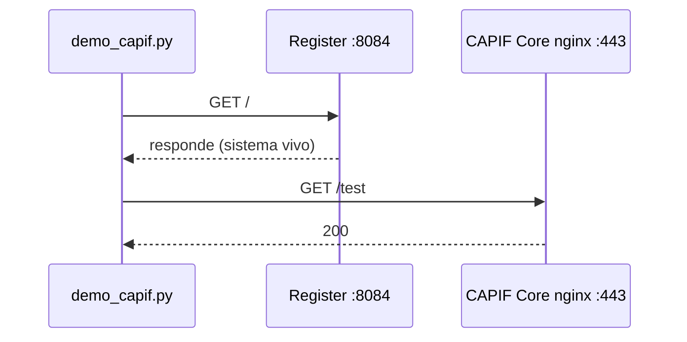
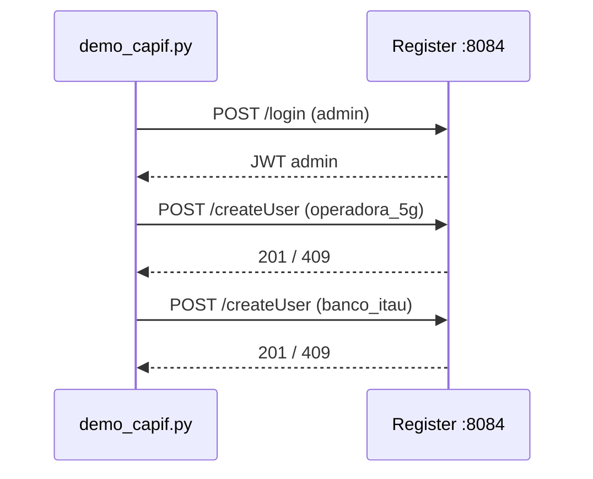
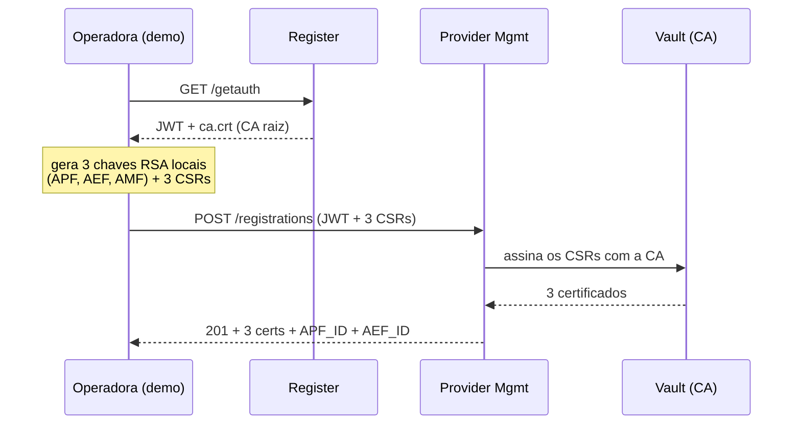
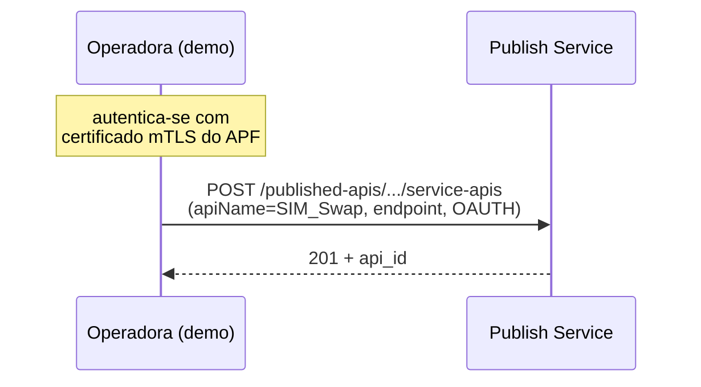
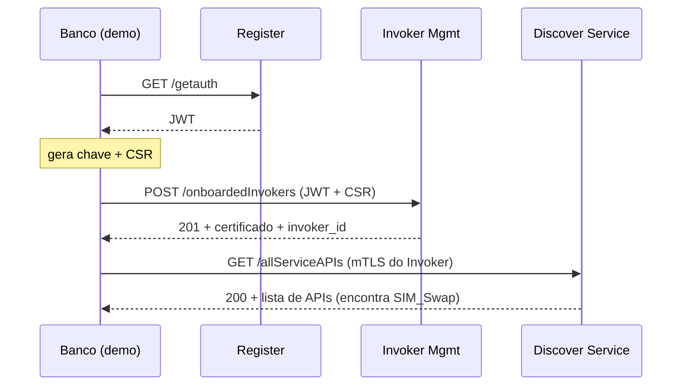
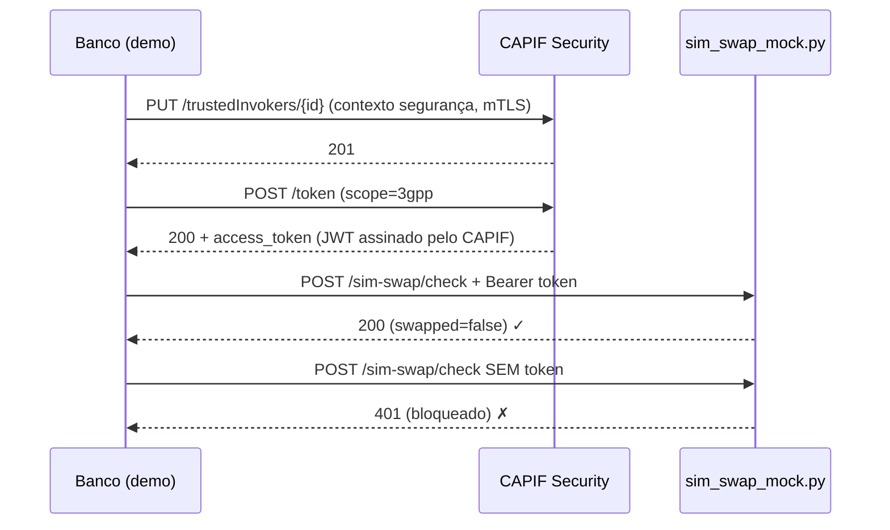

# Demo CAPIF — Guia de Apresentação

> Como correr a demo, o que cada script faz, e o que mostrar/explicar ao professor.
> Tecnologia: **OpenCAPIF** — o Common API Framework do 3GPP (TS 29.222) para redes 5G.

---

## 1. Como se corre

A demo precisa de **dois terminais**: um para o servidor da Operadora (o AEF), outro para o cliente que faz o fluxo todo.

```bash
# ── TERMINAL 1 ──  Servidor AEF da Operadora 5G — deixa a correr o tempo todo
cd ~/capif
python3 sim_swap_mock.py

# ── TERMINAL 2 ──  Limpa corridas anteriores e corre a demo
cd ~/capif
./reset_demo.sh        # IMPORTANTE: corre antes de cada demo (ver porquê abaixo)
python3 demo_capif.py
```

A demo **para em cada passo** e espera que primas ENTER — é o tempo para explicares e mostrares o MongoDB no browser.

**Pré-requisito:** o sistema CAPIF (23 containers Docker) tem de estar a correr.
```bash
docker ps --format "table {{.Names}}\t{{.Status}}"   # devem aparecer 23+ "Up"
# Se não estiver:  cd ~/capif/services && ./run.sh && sleep 30 && docker restart register && sleep 20
```

### Porque é que existe o `./reset_demo.sh`

Cada corrida da demo **publica uma API nova** no catálogo (não substitui a anterior). Sem limpar, o Discovery (Passo 5) mostra a SIM Swap API repetida N vezes. O `reset_demo.sh` apaga os dados das corridas anteriores em 1 segundo (sem destruir containers). Resultado: Discovery mostra **exatamente 1** API.

---

## 2. O que cada script faz

### `sim_swap_mock.py` — o servidor da Operadora (o "AEF")

**O que é:** um servidor HTTP minúsculo (só biblioteca padrão do Python) que **finge ser o servidor real da Operadora 5G** que expõe a SIM Swap API.

**Porque existe:** o OpenCAPIF (versão community/ETSI) implementa só o **plano de gestão** — onboarding, discovery, emissão de tokens. **Não faz proxy do tráfego real.** Por isso o Banco chama o servidor da Operadora **diretamente**, e é esse servidor (o AEF) que **valida o token** que o CAPIF emitiu. Este mock é esse servidor.

**O que faz em cada pedido a `POST /sim-swap/check`** — funciona como um porteiro com 4 verificações:

| # | Verificação | Resposta se falha |
|---|---|---|
| 1 | Traz header `Authorization: Bearer <token>`? | **401** unauthorized |
| 2 | O token é um JWT legível? | **401** invalid_token |
| 3 | O `scope` do token contém `SIM_Swap`? | **403** insufficient_scope |
| 4 | Tudo OK → executa a lógica e responde | **200** `{"swapped": false, ...}` |

> **Nota honesta (boa para mencionar):** o mock **descodifica** o token e valida o scope, mas **não verifica a assinatura**. Numa operadora real, o AEF confirmaria a assinatura do JWT contra a chave pública do CAPIF, para garantir que o token não foi falsificado. Para a demo, validar o scope é suficiente para mostrar o controlo de acesso.

### `demo_capif.py` — o cliente que percorre o fluxo CAPIF completo

**O que é:** um script interativo que faz, em 6 passos, **todo o ciclo de vida de uma API no CAPIF**, falando com o sistema real via HTTPS.

A história que conta:
- A **Operadora 5G** tem uma API de deteção de fraude (SIM Swap).
- O **Banco Itaú** quer usá-la para proteger transações.
- O **CAPIF** é o porteiro: controla quem publica e quem acede.

Demonstra **três camadas de segurança**: `JWT (login) → mTLS (registo) → OAuth2 (acesso)`.

---

## 3. Fluxo geral (Mermaid)



**Ideia-chave a transmitir:** todo o tráfego de **gestão** (passos 2 a 6 da esquerda) passa pelo CAPIF. Mas a **chamada real à API** (Passo 6, seta para o `sim_swap_mock`) vai **direta** ao servidor da Operadora — o CAPIF só emitiu o "bilhete" (token).

---

## 4. Os 6 passos — fluxo + o que dizer + o que ver no browser

### Passo 1 — Verificar o sistema



- **O que dizer:** *"O sistema são 23 containers Docker — 11 microserviços Flask, mais nginx, MongoDB, Redis e Vault. É a arquitetura Service-Based do 5G Core."*
- **Browser:** http://localhost:8082 — ainda vazio (mostrar que começamos do zero).

---

### Passo 2 — Criar utilizadores



- **O que dizer:** *"O Register é o balcão de entrada. Cria duas contas: a Operadora (quem vai publicar) e o Banco (quem vai consumir). Os utilizadores ficam numa BD separada do CAPIF Core."*
- **Browser:** http://localhost:8083 → base `capif_users` → coleção `user` → vês `operadora_5g` e `banco_itau`.

---

### Passo 3 — Operadora regista-se como Provider (mTLS)



- **O que dizer:** *"O CAPIF não autentica a Operadora por password — usa certificados mTLS que ele próprio emite. A Operadora gera as chaves privadas localmente (nunca saem da máquina) e só envia pedidos de assinatura (CSRs). O CAPIF assina-os com a sua autoridade certificadora (Vault) e devolve os certificados."*
- **Browser:** http://localhost:8082 → base `capif` → coleção `providerenrolmentdetails` → vês a Operadora com os 3 certificados (APF, AEF, AMF).

---

### Passo 4 — Operadora publica a SIM Swap API



- **O que dizer:** *"Agora a Operadora autentica-se com o certificado do APF (emitido no passo anterior) e publica a ficha da API no catálogo: nome, endpoint (`/sim-swap/check`), e que segurança exige (OAuth2). O CAPIF guarda só a metadata — não serve a API."*
- **Browser:** http://localhost:8082 → `capif` → `serviceapidescriptions` → vês a SIM Swap API com o endpoint e o método de segurança.

---

### Passo 5 — Banco regista-se como Invoker e descobre a API



- **O que dizer:** *"O Banco faz o mesmo onboarding que a Operadora — recebe o seu certificado. Depois faz Discovery: pergunta ao catálogo 'que APIs existem?' e encontra a SIM Swap sem nunca ter falado com a Operadora. É como procurar na App Store."*
- **Browser:** http://localhost:8082 → `capif` → `invokerdetails` → vês o Banco Itaú com o certificado.

---

### Passo 6 — Token OAuth2 e chamada real à API



- **O que dizer:** *"O Banco regista um contexto de segurança e pede um token OAuth2 ao CAPIF, com um scope que identifica exatamente esta API. O CAPIF devolve um JWT assinado — o 'bilhete'. O Banco chama então o servidor da Operadora DIRETAMENTE (o CAPIF não faz proxy) com o token: o AEF valida o scope e responde 200. Sem token → 401. Isto é o controlo de acesso em ação."*
- **Browser:** http://localhost:8082 → `capif` → `serviceapisecurity` → vês o contexto OAuth2.
- **Terminal 1 (o mock):** mostra ao vivo os logs `200` (com token) e `401` (sem token).

---

## 5. Onde cada passo deixa marca no MongoDB

| Passo | Browser (Mongo Express) | Base / Coleção | O que aparece |
|---|---|---|---|
| 2 | http://localhost:8083 | `capif_users` / `user` | operadora_5g + banco_itau |
| 3 | http://localhost:8082 | `capif` / `providerenrolmentdetails` | Operadora + 3 certificados |
| 4 | http://localhost:8082 | `capif` / `serviceapidescriptions` | SIM Swap API |
| 5 | http://localhost:8082 | `capif` / `invokerdetails` | Banco Itaú |
| 6 | http://localhost:8082 | `capif` / `serviceapisecurity` | Contexto OAuth2 |

Login do Mongo Express: `admin` / `admin`.

---

## 6. Frase de fecho para o professor

> *"Demonstrei o ciclo completo de uma Northbound API 5G no framework CAPIF do 3GPP: a operadora publica uma capacidade da rede (deteção de SIM Swap), o consumidor descobre-a através do framework, e acede-a com três camadas de segurança — JWT no login, mTLS com certificados no registo, e OAuth2 em cada chamada. É exatamente o mecanismo que as operadoras usam para monetizar e expor capacidades da rede 5G de forma controlada."*
