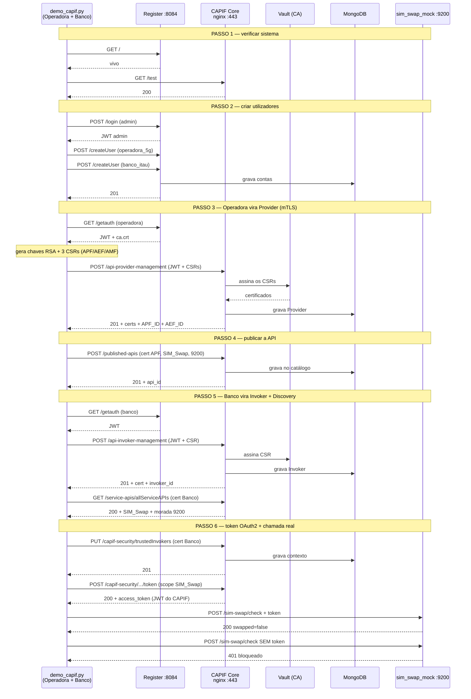
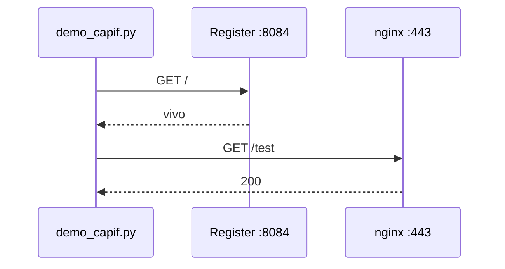
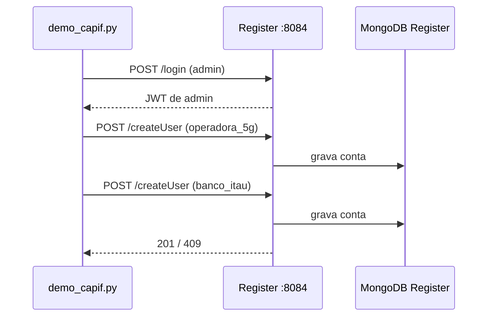
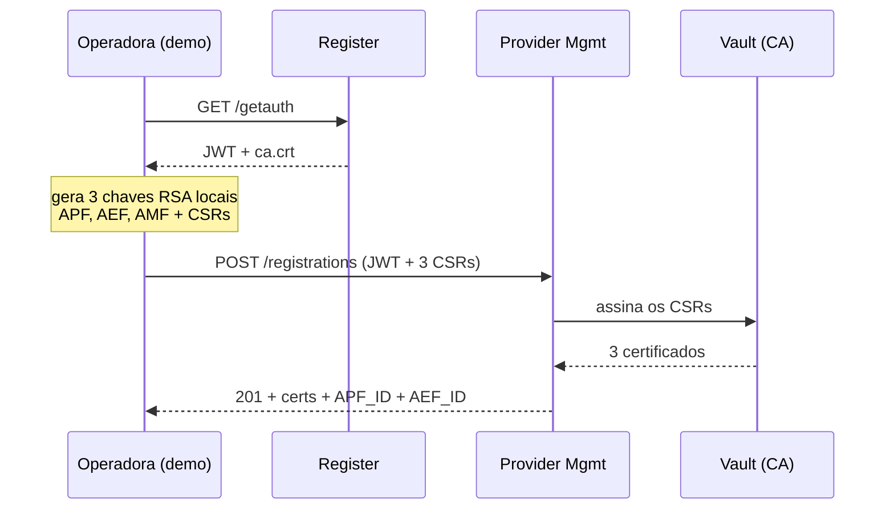
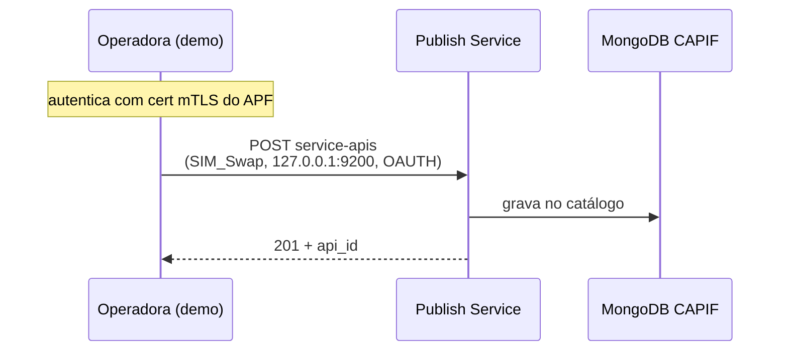
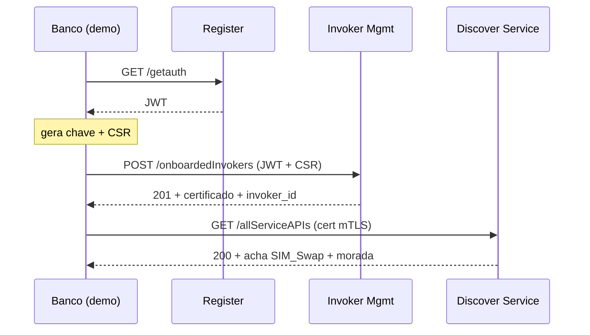
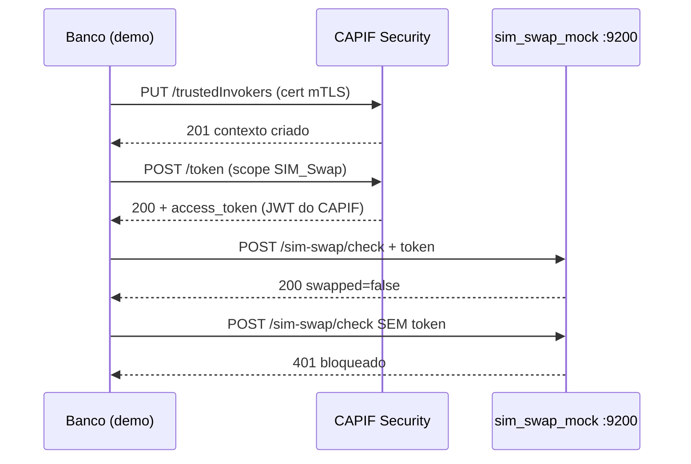

# Notas dos Passos — Demo CAPIF

> Notas de estudo e apresentação para o `demo_capif.py`.
> Cada passo: **diagrama Mermaid + o que faz + notas**.
> Diagramas renderizam no preview do VS Code ou em https://mermaid.live

---

## Conceitos-base (decora estes 5)

| Conceito | O que é (em 1 frase) |
|---|---|
| **Register** | Balcão de receção do OpenCAPIF (porta 8084) — cria contas e dá a 1ª credencial. **Não** faz parte da norma 3GPP; é um extra da ETSI. |
| **nginx** | Proxy reverso (porta 443) — porta de entrada única do CAPIF Core. Termina o HTTPS/mTLS e encaminha cada pedido para o microserviço certo. |
| **JWT** | Crachá digital temporário que prova "sou eu, fiz login". Assinado, não se falsifica. (1ª camada) |
| **CA root (ca.crt)** | O "carimbo oficial" da autoridade certificadora do CAPIF. Serve para verificar que os certificados são autênticos. (base do mTLS) |
| **mTLS / OAuth2** | mTLS = identidade por certificado (2ª camada). OAuth2 = token de acesso por chamada (3ª camada). |

**As 3 camadas de segurança:** `JWT (login) → mTLS (registos) → OAuth2 (cada chamada)`.

---

## Fluxo geral — todos os 6 passos

**Ideia central:** o script faz de dois personagens — a Operadora (P3-4) e o Banco (P5-6). Toda a gestão passa pelo CAPIF; só a chamada final (P6) vai direta ao servidor da Operadora (o mock).

---

## PASSO 1 — Verificar que o sistema está vivo

**O que faz** → Dois pings (`GET /` ao Register, `GET /test` ao nginx) para confirmar que os dois pontos de entrada respondem. Não cria nada — só valida que os 23 containers estão de pé.

**Notas** → Se falhar aqui, o sistema Docker não está a correr; MongoDB começa vazio (estado limpo).

---

## PASSO 2 — Criar utilizadores

**O que faz** → Login como `admin` → recebe JWT de administrador. Com esse crachá cria duas contas no Register: `operadora_5g` (Provider) e `banco_itau` (Invoker). `409` = "já existia" (tratado como sucesso).

**Notas** → **1ª camada (JWT)**; contas no MongoDB do Register → http://localhost:8083 → `capif_users` → `user`.

---

## PASSO 3 — Operadora regista-se como Provider (mTLS)

**O que faz** → A Operadora pede JWT + ca.crt. Gera 3 pares de chaves RSA na máquina (APF publica, AEF expõe, AMF gere) e envia os CSRs (só chave pública). O CAPIF assina-os com o Vault e devolve os certificados mTLS + os IDs.

**Notas** → **2ª camada (mTLS)**; a chave privada **nunca sai da máquina**, só se enviam CSRs; resultado → `capif` → `providerenrolmentdetails`.

---

## PASSO 4 — Publicar a SIM Swap API

**O que faz** → Com o certificado do APF como identidade, publica a ficha da API: nome, morada do servidor (`127.0.0.1:9200`), caminho (`/sim-swap/check`) e segurança (OAUTH). O CAPIF guarda só a metadata — não transporta tráfego.

**Notas** → É aqui que se regista **onde vive o `sim_swap_mock.py`** (porta 9200), morada que o Banco vai descobrir; resultado → `capif` → `serviceapidescriptions`.

---

## PASSO 5 — Banco regista-se e descobre a API (Discovery)

**O que faz** → Primeiro o onboarding do Banco (recebe o seu próprio certificado). Depois o Discovery: pergunta ao catálogo que APIs existem e encontra a SIM Swap com a sua morada. O script extrai essa morada para usar no Passo 6.

**Notas** → O Banco descobre a API **sem nunca falar com a Operadora** — o catálogo é o intermediário (como uma App Store); resultado → `capif` → `invokerdetails`.

---

## PASSO 6 — Token OAuth2 e chamada real

**O que faz** → O Banco cria um contexto de segurança, pede um token OAuth2 com scope para esta API, e recebe um JWT assinado pelo CAPIF. Depois chama o mock **com** token (→ 200) e **sem** token (→ 401), provando o controlo de acesso.

**Notas** → **3ª camada (OAuth2)**; a chamada final vai **direta** ao mock (não passa pelo CAPIF); resultado → `capif` → `serviceapisecurity`.

---

## Onde cada passo deixa marca no MongoDB

| Passo | Browser | Base / Coleção | O que aparece |
|---|---|---|---|
| 2 | http://localhost:8083 | `capif_users` / `user` | operadora_5g + banco_itau |
| 3 | http://localhost:8082 | `capif` / `providerenrolmentdetails` | Operadora + 3 certificados |
| 4 | http://localhost:8082 | `capif` / `serviceapidescriptions` | SIM Swap API |
| 5 | http://localhost:8082 | `capif` / `invokerdetails` | Banco Itaú |
| 6 | http://localhost:8082 | `capif` / `serviceapisecurity` | Contexto OAuth2 |

Login Mongo Express: `admin` / `admin`.

---

## Frase de resumo (para o fecho)

> O script percorre o ciclo de vida completo de uma API no CAPIF: **registar** as entidades (JWT + certificados), **publicar** a API no catálogo, **descobrir** a API do lado do consumidor, **autorizar** com um token OAuth2, e **chamar** o servidor real — provando que sem o token do CAPIF não há acesso. Três camadas: JWT → mTLS → OAuth2.
