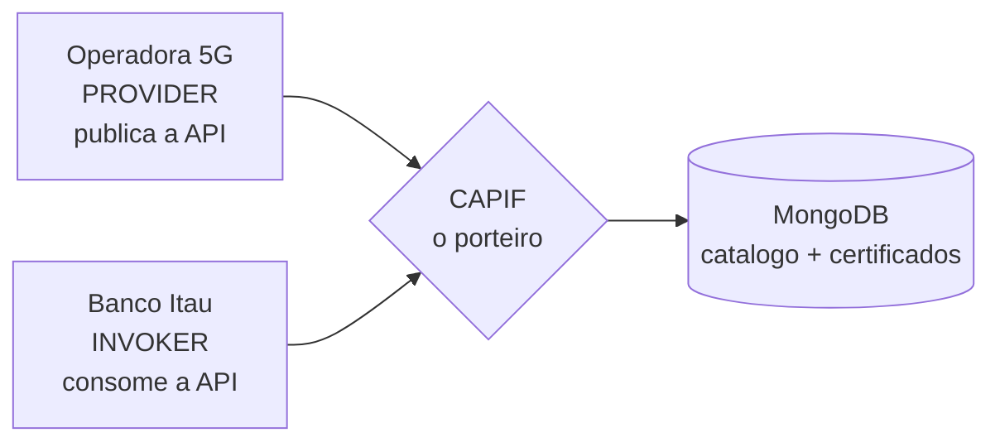
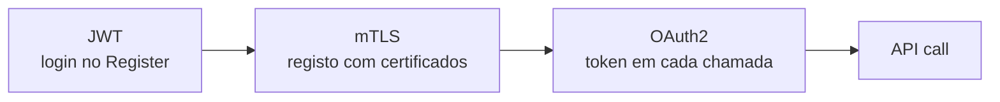
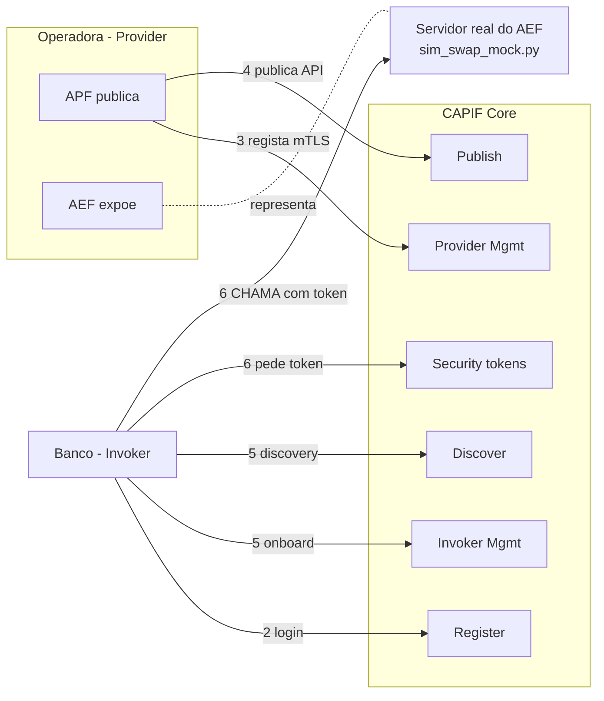
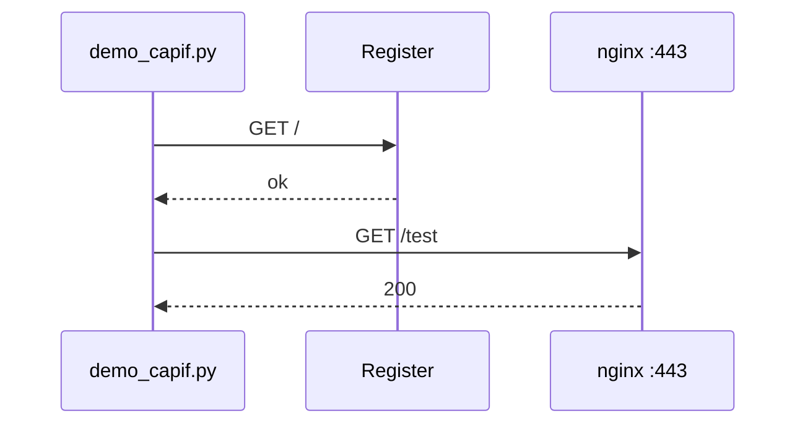
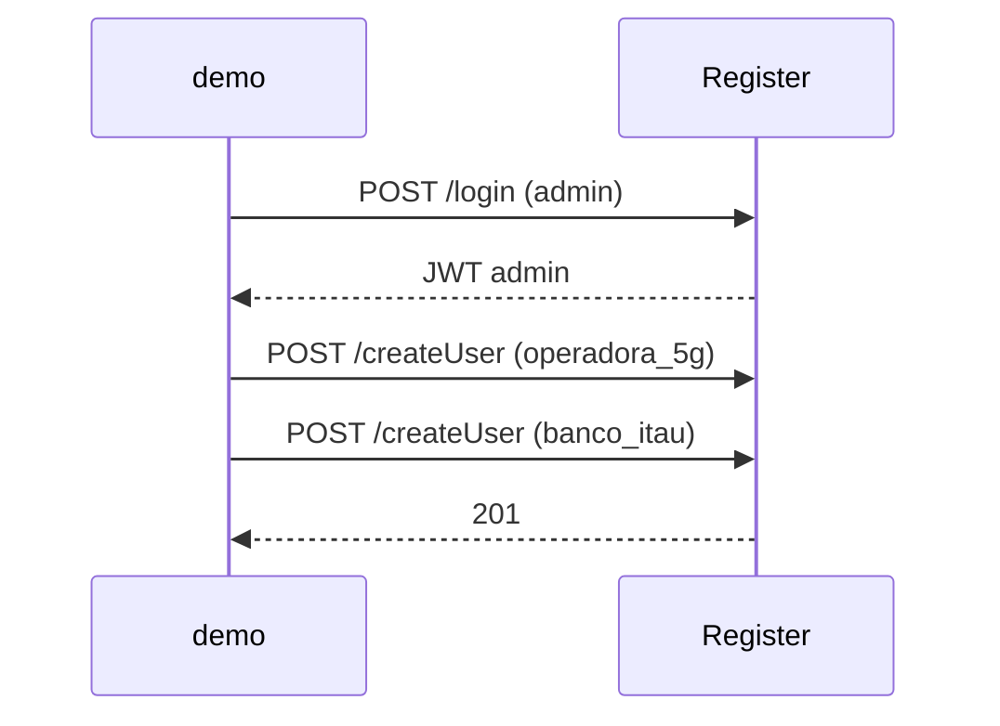
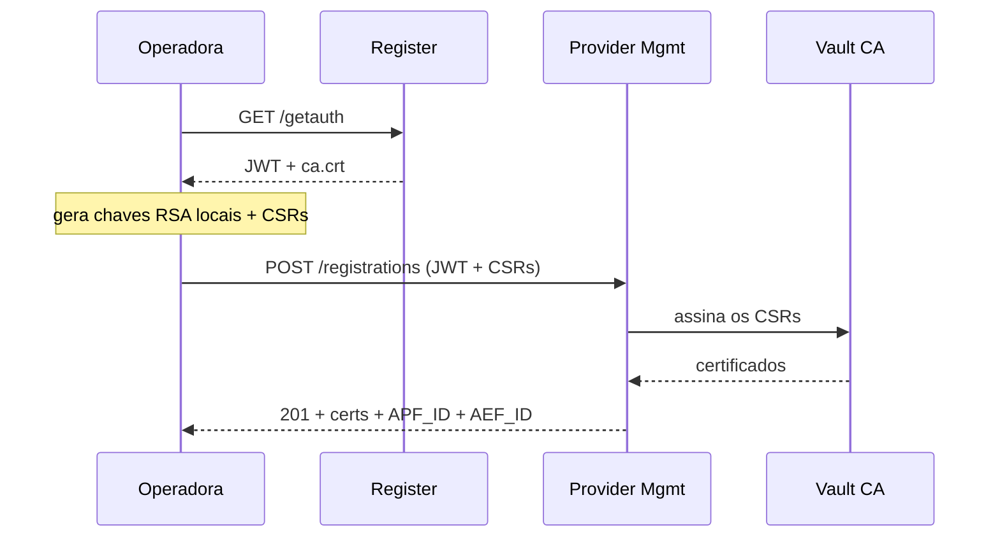
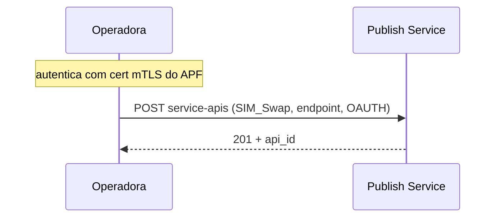
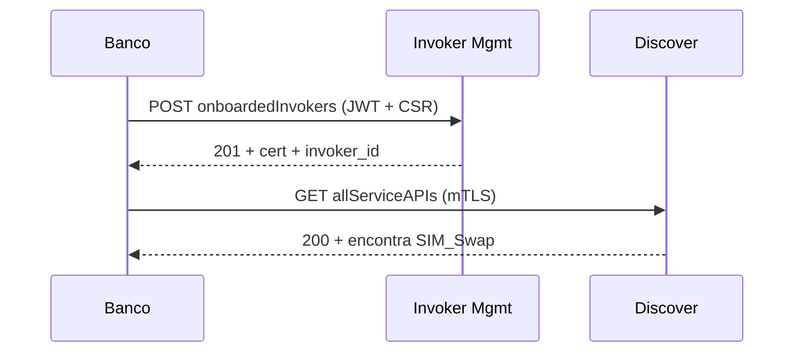
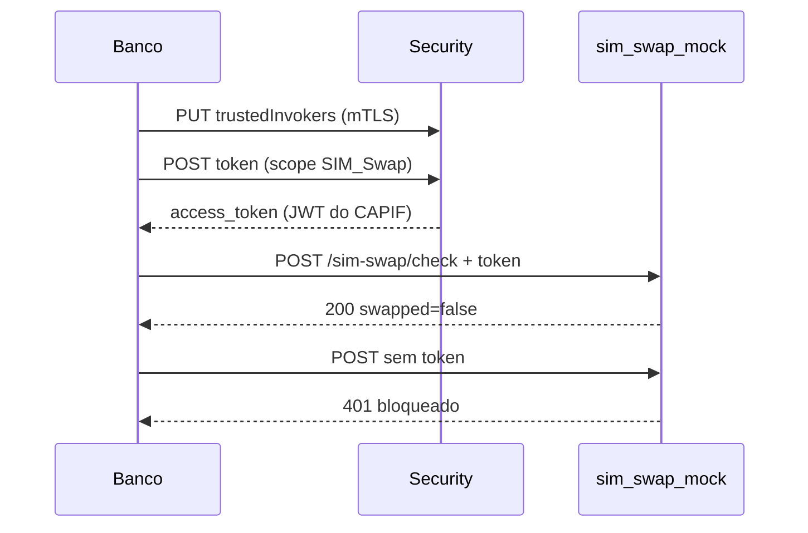

# Plano de Slides — Apresentação CAPIF

> Estrutura slide-a-slide para PPT. Cada slide tem: **VISUAL** (o que pões no slide)
> e **FALA** (o que dizes). Os diagramas Mermaid podes converter em imagem em
> https://mermaid.live (copia o código → "Download PNG/SVG" → mete no PPT).
>
> Duração alvo: ~10-12 min de fala + demo ao vivo.

---

## SLIDE 1 — Título

**VISUAL:**
- Título: **OpenCAPIF — Expor APIs de Rede 5G com Segurança**
- Subtítulo: Common API Framework do 3GPP (TS 29.222)
- O teu nome / bolsa de Redes

**FALA:**
> "Vou apresentar o CAPIF — o framework que o 3GPP define para as operadoras 5G exporem capacidades da sua rede a aplicações externas, de forma controlada e segura. Implementei a versão open-source, o OpenCAPIF da ETSI, e fiz uma demo do fluxo completo."

---

## SLIDE 2 — O problema (porque é que isto é Redes)

**VISUAL (bullets):**
- Redes 5G já não são só "dar internet" → expõem **capacidades da rede** (Network Exposure)
- Exemplos: localização, qualidade de serviço (QoS), **deteção de SIM Swap**
- Problema: como deixar uma app externa (ex: um banco) usar a API da rede **sem deixar entrar qualquer um**?
- Resposta do 3GPP: **CAPIF** — o porteiro das Northbound APIs 5G

**FALA:**
> "No 5G a rede tornou-se software: o 5G Core é feito de microserviços que falam por APIs — é a chamada Service-Based Architecture. A operadora pode expor estas APIs a terceiros para gerar valor. Mas precisa de um porteiro que controle quem publica e quem acede. Esse porteiro é o CAPIF."

---

## SLIDE 3 — Os 3 atores

**VISUAL (Mermaid):**



**FALA:**
> "Três papéis: o Provider — a Operadora, que publica a API SIM Swap; o Invoker — o Banco Itaú, que a quer consumir; e o CAPIF no meio, que controla tudo e guarda o estado no MongoDB."

---

## SLIDE 4 — Arquitetura do sistema

**VISUAL (bullets + foto/print do `docker ps`):**
- **23 containers Docker**
- 11 microserviços Flask (Provider Mgmt, Publish, Invoker Mgmt, Discover, Security, Events, Logging, Auditing, Access Control, Routing, Open Discover)
- nginx (proxy reverso + TLS), MongoDB x2, Redis, Vault (autoridade certificadora), Celery

**FALA:**
> "O sistema reflete a arquitetura real do 5G Core: microserviços independentes atrás de um gateway nginx, com TLS em todo o lado. O Vault faz de autoridade certificadora — emite os certificados. Isto não é um brinquedo, é a implementação de referência da ETSI."

---

## SLIDE 5 — As 3 camadas de segurança (a mensagem-chave)

**VISUAL (Mermaid):**



**FALA:**
> "Esta é a ideia central da apresentação. O CAPIF empilha três camadas de segurança: um token JWT para fazer login, certificados mTLS para o registo das entidades, e um token OAuth2 para cada chamada à API. Vou mostrar as três a funcionar ao vivo."

---

## SLIDE 6 — Fluxo geral

**VISUAL (Mermaid):**



**FALA (importantíssimo):**
> "Reparem numa coisa: toda a gestão — registo, publicação, discovery, tokens — passa pelo CAPIF. MAS a chamada real à API vai DIRETA da app ao servidor da Operadora. O OpenCAPIF não faz proxy do tráfego; ele só emite o 'bilhete' (o token), e é o servidor da Operadora que o valida. Por isso, na minha demo, esse servidor é simulado por um pequeno mock em Python."

---

## SLIDES 7-12 — Os 6 passos da demo

> Mostra **um diagrama por passo** (os 6 sequence diagrams de baixo) e diz a FALA.
> Idealmente fazes a demo AO VIVO em paralelo, e estes slides são o mapa.

### SLIDE 7 — Passo 1: Sistema vivo

**FALA:** "Confirmo que os 23 containers respondem. O MongoDB começa vazio."

### SLIDE 8 — Passo 2: Criar utilizadores

**FALA:** "Crio as duas contas. Mostro no browser que aparecem no MongoDB do Register."

### SLIDE 9 — Passo 3: Provider regista-se (mTLS)

**FALA:** "A Operadora gera as chaves privadas LOCALMENTE — nunca saem. Envia só pedidos de assinatura. O CAPIF assina-os com o Vault e devolve os certificados mTLS. Isto é a camada 2 da segurança."

### SLIDE 10 — Passo 4: Publicar a API

**FALA:** "Com o certificado do passo anterior, a Operadora publica a ficha da SIM Swap API no catálogo. Mostro no MongoDB a API a aparecer."

### SLIDE 11 — Passo 5: Invoker + Discovery

**FALA:** "O Banco regista-se e faz Discovery: pergunta ao catálogo que APIs existem e encontra a SIM Swap, sem nunca ter falado com a Operadora. É como a App Store."

### SLIDE 12 — Passo 6: Token OAuth2 + chamada real

**FALA:** "O Banco pede o token OAuth2 ao CAPIF — a camada 3. Depois chama o servidor da Operadora diretamente: COM token responde 200, SEM token responde 401. Esta é a prova do controlo de acesso."

---

## SLIDE 13 — O que cada script faz

**VISUAL (2 colunas):**
- **demo_capif.py** = o cliente que percorre os 6 passos (Operadora + Banco)
- **sim_swap_mock.py** = o servidor real da Operadora (o AEF) que valida o token
  - 4 verificações: sem token→401, token inválido→401, scope errado→403, OK→200
  - Nota honesta: valida o scope, não a assinatura (numa operadora real verificaria a assinatura do JWT)

**FALA:**
> "Dois scripts. O demo_capif.py é o cliente que faz todo o fluxo. O sim_swap_mock.py simula o servidor da Operadora, e faz controlo de acesso em 4 níveis. Documentei propositadamente que, numa operadora real, este servidor verificaria também a assinatura do token contra a chave pública do CAPIF."

---

## SLIDE 14 — Conclusão

**VISUAL (bullets):**
- CAPIF = porteiro das Northbound APIs 5G (standard 3GPP real)
- Fluxo completo demonstrado: publicar → descobrir → autorizar → chamar
- 3 camadas: JWT + mTLS + OAuth2
- Adaptei o projeto para correr fora da infraestrutura ETSI (imagens públicas)

**FALA (fecho):**
> "Demonstrei o ciclo completo de uma Northbound API 5G no CAPIF: a operadora expõe uma capacidade da rede, o consumidor descobre-a através do framework, e acede-a com três camadas de segurança. É exatamente o mecanismo que as operadoras usam para monetizar e expor capacidades 5G de forma controlada. Obrigado."

---

## CHECKLIST antes de apresentar

```bash
# 1. Sistema de pé?
docker ps --format "table {{.Names}}\t{{.Status}}"   # 23+ "Up"

# 2. Limpar corridas anteriores
cd ~/capif && ./reset_demo.sh

# 3. Terminal 1 — servidor da Operadora (deixar aberto)
python3 sim_swap_mock.py

# 4. Terminal 2 — a demo
python3 demo_capif.py

# 5. Browser aberto em http://localhost:8082  (login admin/admin)
```

**Ordem de janelas no ecrã:** Terminal da demo + browser MongoDB lado a lado, e o terminal do mock visível para mostrar os 200/401.
